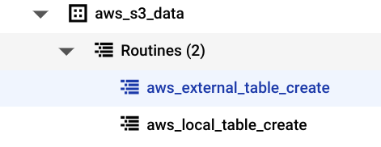
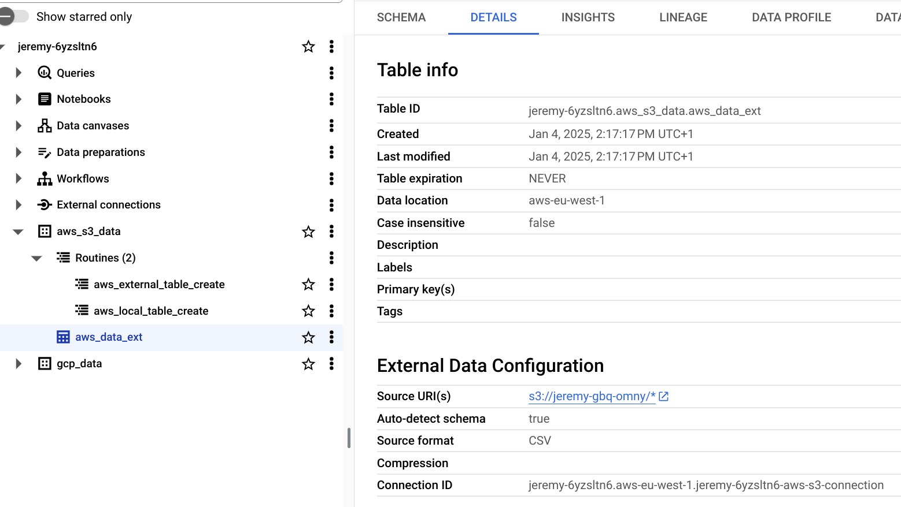
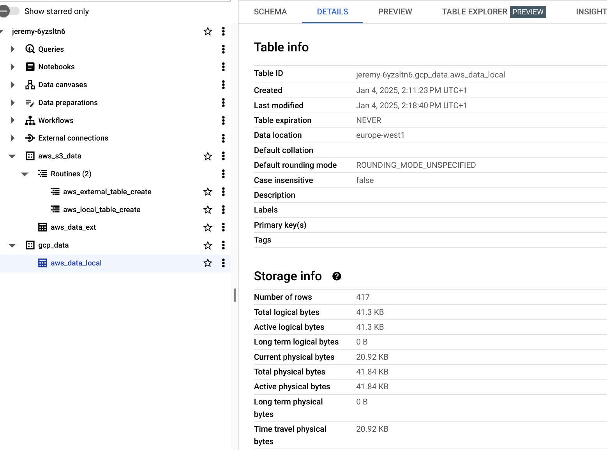

# BigQuery OMNI example (with AWS S3)

In this example, we are creating 2 datasets in BigQuery (one "omny" `aws_s3_data` and one regional `gcp_data`). In each dataset, we will be creating one table. The table in the `aws_s3_data` dataset will an `EXTERNAL TABLE` pointing to the original S3 bucket in AWS, while the table in `gcp_data` dataset will be a GCP `MANAGED TABLE` with a copy of the data.

## AWS Setup (1/2)

1. Log in the AWS console, and choose the Service `S3` and the region `eu-west-1`. Make sure you choose a location in AWS which is compatible with BigQuery Omni locations: https://cloud.google.com/bigquery/docs/locations#omni-loc. Create a S3 bucket and give it a name `YOUR_S3_BUCKET` (in my example `jeremy-gbq-omny`). Upload the file `stations.csv` from the `files` sub-directory.

2. Go to `IAM` => `Policies`, and create a new Policy. Append the follwing as the policiy definition:

```shell
{
    "Version": "2012-10-17",
    "Statement": [
        {
            "Effect": "Allow",
            "Action": [
                "s3:ListBucket"
            ],
            "Resource": [
                "arn:aws:s3:::<YOUR_S3_BUCKET>"
            ]
        },
        {
            "Effect": "Allow",
            "Action": [
                "s3:GetObject"
            ],
            "Resource": [
                "arn:aws:s3:::<YOUR_S3_BUCKET>",
                "arn:aws:s3:::<YOUR_S3_BUCKET>/*"
            ]
        }
    ]
}
```

3. Create a new `IAM` => `Roles`, as an `AWS service` by specifying the `S3` service, and by attaching the previous custom policy. Once created, write down the ARN, which is in the form:

```shell
arn:aws:iam::<ACCOUNT_ID>:role/<YOUR_AWS_ROLE>
```

> Note: Leave the role "as is" for the moment, it will need to be edited after some steps in GCP


## GCP Setup (1/2)

1. Find out your GCP project's id and number from the dashboard in the cloud console, and update the following variables in the `terraform.tfvars.json` file. Replace `YOUR_PROJECT_NMR`, `YOUR_PROJECT_ID`, `your_project_region` with the correct values. 

```shell
{
    "project_id": "<YOUR_PROJECT_ID>",
    "project_nmr": <YOUR_PROJECT_NMR>,
    "project_default_region": "<YOUR_PROJECT_REGION>",
    "aws_role_id": "arn:aws:iam::<ACCOUNT_ID>:role/<YOUR_AWS_ROLE>",
    "aws_s3_region": "<BigQuery_AWS_region_name_from https://cloud.google.com/bigquery/docs/locations#omni-loc>"
    "aws_s3_bucket_name": "<YOUR_S3_BUCKET>",
    "gcp_data_region": "<YOUR_LOCAL_GCP_DATASET_REGION>"
}
```


2. Run the following command at the root of the folder:
```shell 
$ ./install.sh
$ terraform init
$ terraform plan
$ terraform apply
```


3. The infrastructure created will be as follows:

* An external connection resource with the AWS Role
* A BigQuery dataset `aws_s3_data` in the same region as the S3 bucket (in this case `aws-eu-west-1`)
* A BigQuery dataset `gcp_data` in the same region as the S3 bucket (in this case `europe-west1`)
* A BigQuery routine in the dataset `aws_s3_data` called `aws_external_table_create`
* A BigQuery routine in the dataset `aws_s3_data` called `aws_local_table_create`


## AWS Setup (2/2)

1. In the AWS console, find the role created previously, and go into the tab `Trust relationships`. Copy the `bigquery_google_identity` number from the terraform output. Edit the trust policy with the following:

```shell
{
    "Version": "2012-10-17",
    "Statement": [
        {
            "Effect": "Allow",
            "Principal": {
                "Federated": "accounts.google.com"
            },
            "Action": "sts:AssumeRoleWithWebIdentity",
            "Condition": {
                "StringEquals": {
                    "accounts.google.com:aud": "<bigquery_google_identity_number>"
                }
            }
        }
    ]
}
```


## GCP Setup (2/2)

1. Back into Google Cloud Platform console, navigate to BigQuery anx expand the `aws_s3_data` dataset. There should be 2 routines available.



2. Click on `aws_external_table_create` so that it opens in BigQuery studio. Click on `INVOKE STORED PROCEDURE`. This should open a new panel with a `CALL` function. Click on `RUN` to execute it. This will in turn create an `EXTERNAL TABLE` in the `aws_s3_data` dataset which points to the S3 bucket in AWS




3. Repeat the same sequence with the second routine `aws_local_table_create`. Click on `INVOKE STORED PROCEDURE`. This should open a new panel with a `CALL` function. Click on `RUN` to execute it. This will in turn create an `MANAGED TABLE` in the `gcp_data` dataset which has the data copied and loaded into itself.




## Conclusions
This simple example helps you leverage data in a multicloud scenario, where you datawarehouse in BigQuery can fetch and query data in other persistence layers (AWS S3 in this case). The use of routines is only to make the queries available via Terraform, since the `bigquery_google_identity` needs to be updated manually before the queries can be executed